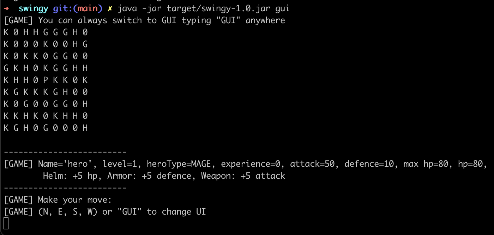
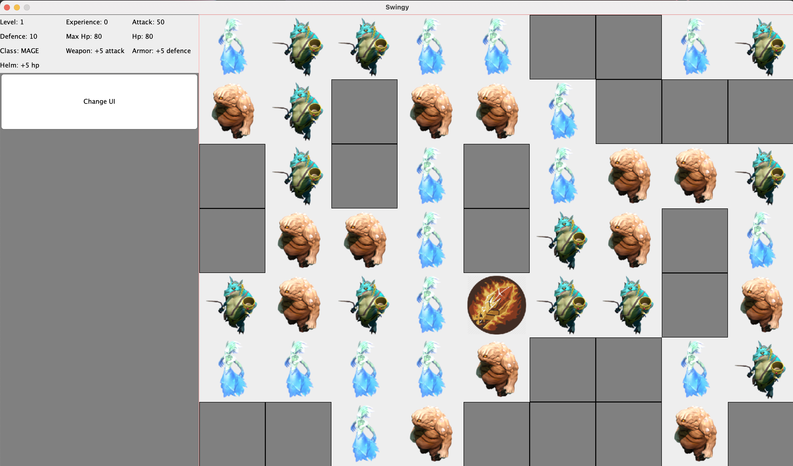

# swingy

[Subject](https://cdn.intra.42.fr/pdf/pdf/61460/en.subject.pdf)

This is the second project from the Java world at 42. You will learn to develop GUI applications with the SWING framework, in order to create an RPG game.

## Result

Special features:<br />
Changing UI in execution <br />
Saving progress in database <br />

Success: 125/100

## Installation

Requirements: <br />
Java 17 <br />
Maven

Maven:

Launching database container:
```bash
  mvn docker:start
```

Creating executable jar file:
```bash
mvn clean package
```

## Usage

```bash
java -jar target/swingy-1.0.jar
```



